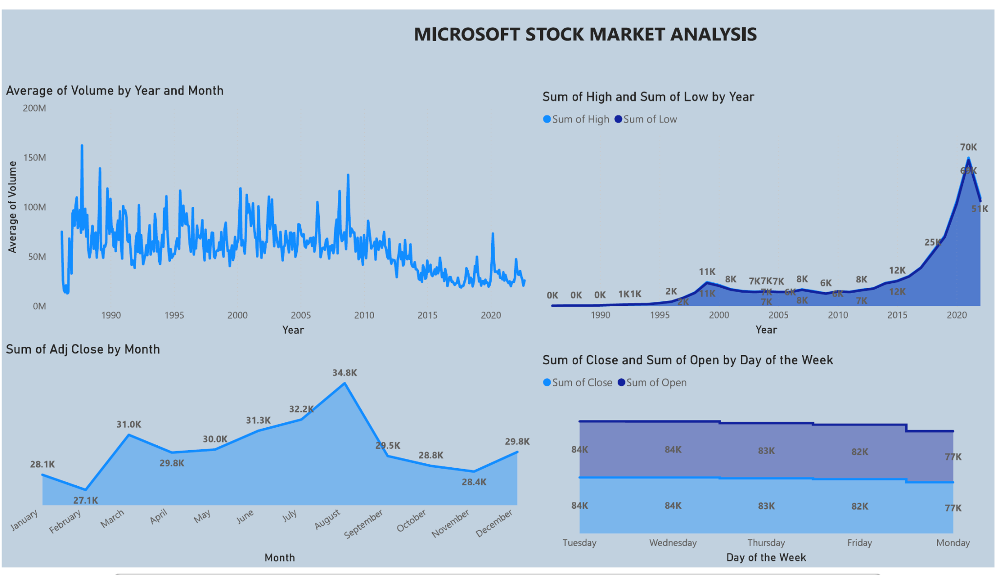

# 📈 Microsoft Stock Market Analysis Dashboard

## 🧾 Overview

The **Microsoft Stock Market Analysis Dashboard** offers a visual representation of Microsoft’s historical stock performance across multiple dimensions—volume trends, pricing highs/lows, and day/month-specific behavior. It serves as a powerful tool for financial analysts, investors, and data enthusiasts tracking long-term market behavior.

---

## 📊 Key Insights

### 🔁 Average Volume by Year and Month

* Tracks fluctuations in Microsoft’s trading volume over time.
* Peaks occurred around 1999–2000, reflecting dot-com bubble activity.
* A general decline in volume is seen post-2010.

### 📉 Sum of High and Low by Year

* Illustrates the yearly sum of high and low prices.
* A sharp rise is observed starting around 2017, culminating in:

  * **High: 70K (2020)**
  * **Low: 51K (2020)**

### 📆 Sum of Adj Close by Month

* Indicates monthly stock close value behavior.
* **Top Month**: August with 34.8K, followed by July and June.

### 🗓️ Sum of Close and Open by Day of the Week

* Compares market open and close values across weekdays.
* Minimal variation, but Tuesday through Thursday show the highest activity (≈84K).

---

## 💼 Use Cases

* **Investor Trend Analysis**: Evaluate historical investment performance and timing.
* **Market Timing Strategy**: Understand which months/days show stronger price movements.
* **Volume Analysis**: Use historical volume data to identify periods of investor activity or volatility.
* **Financial Reports**: Enhance reporting with well-structured visual insights.

---

## 🛠️ Built With

* **Power BI** for dynamic visualizations
* **Microsoft Historical Stock Data** (source-public API)

